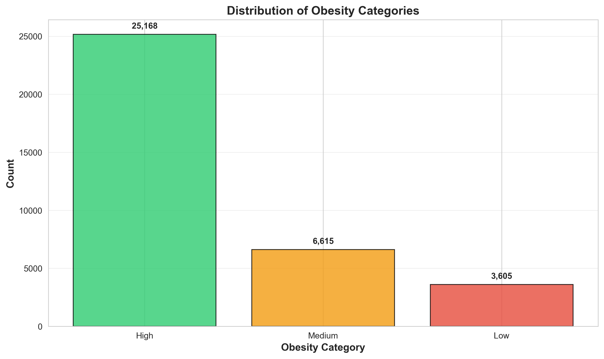
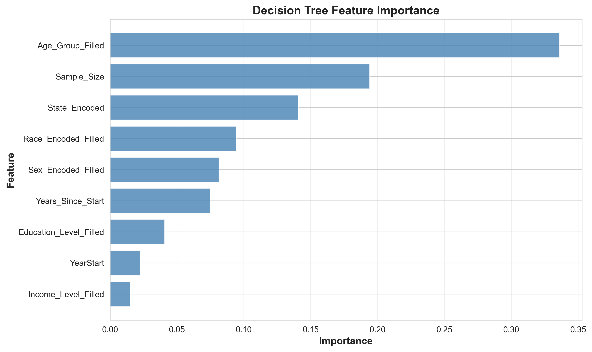
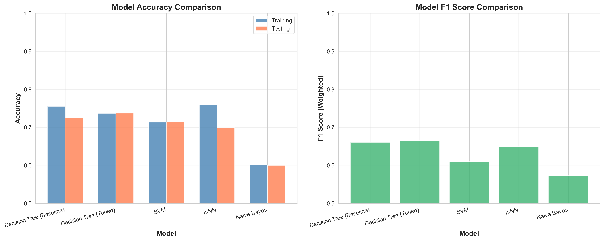
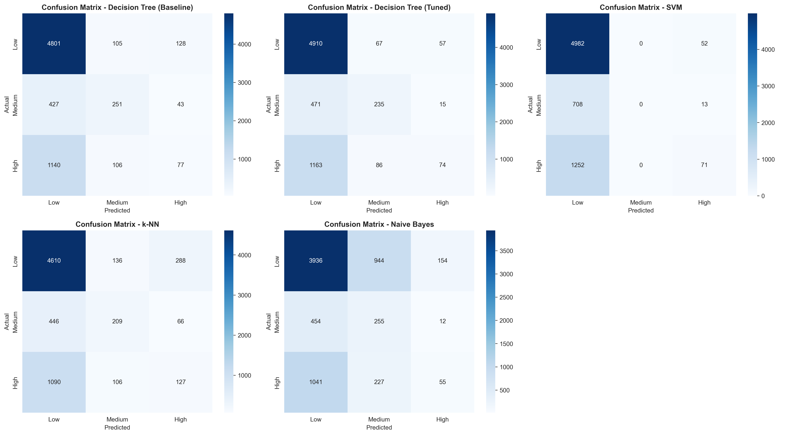
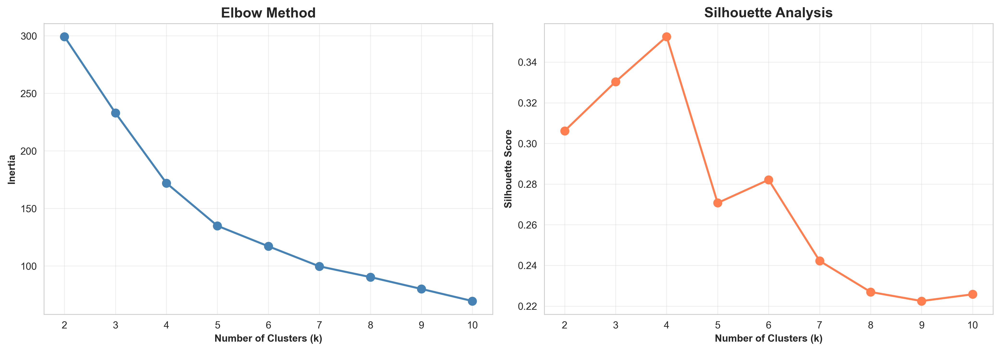
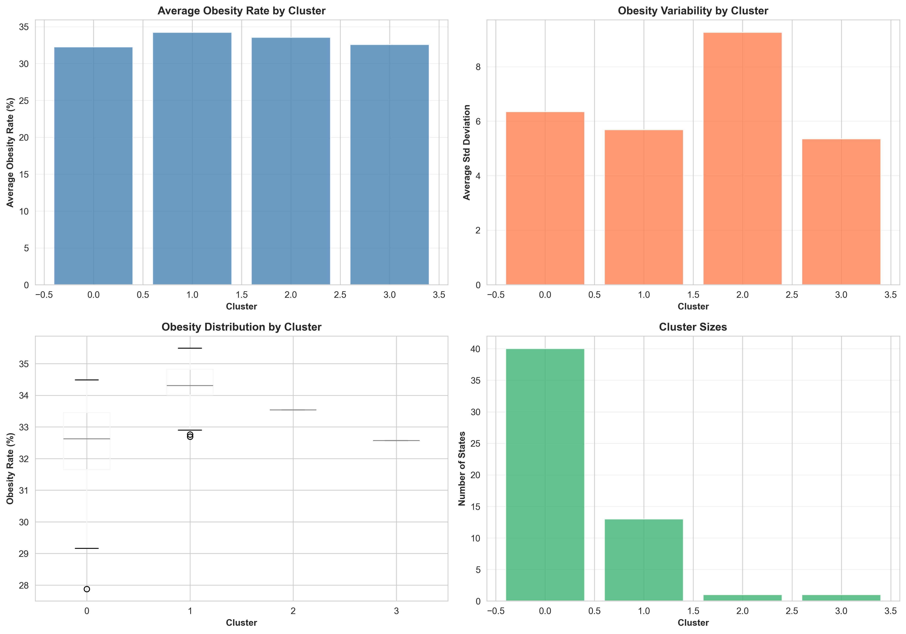
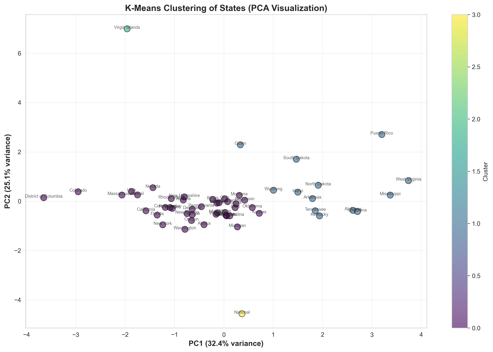
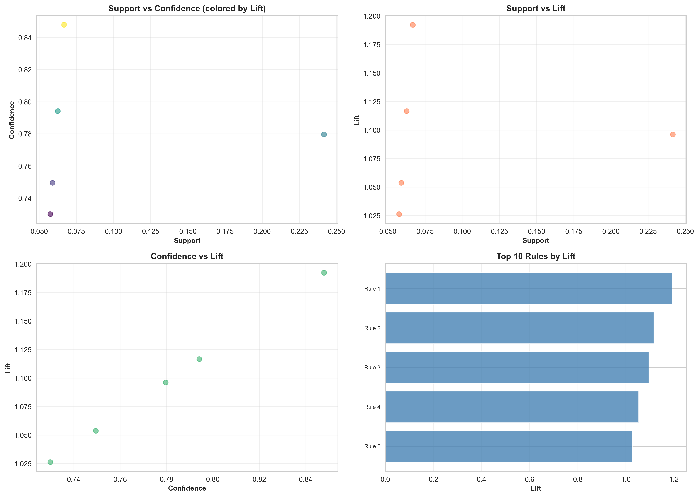

# Classification, Clustering, and Pattern Mining

**Student**: Dheeraj Kollapaneni  
**Course**: MSCS 634 - Advanced Data Mining  
**Date**: December 4, 2025

---

## Overview

This deliverable applies classification, clustering, and association rule mining techniques to the CDC BRFSS obesity dataset. The analysis categorizes obesity levels, identifies state groupings, and discovers patterns between demographic factors and obesity rates.

## Repository Structure

```
deliverable3/
├── deliverable3_classification_clustering.ipynb  
├── screenshots/                                  
└── README.md                               
```

## Analysis Components

### 1. Classification Models

Four classification models were developed to predict obesity categories. The target variable divided obesity rates into three categories based on CDC guidelines: Low (under 25%), Medium (25-30%), and High (over 30%). The dataset contained 35,388 samples with 71% labeled as High obesity, 19% as Medium, and 10% as Low.



**Models Implemented:**

- **Decision Tree**: Used both baseline and tuned versions. The baseline model achieved 72.5% test accuracy. After hyperparameter tuning with GridSearchCV, accuracy improved to 73.7%.

- **SVM**: Trained on a 10,000-sample subset for computational efficiency. Achieved 71.4% test accuracy with an RBF kernel.

- **k-NN**: Simple distance-based classifier with k=5 neighbors. Achieved 69.9% test accuracy.

- **Naive Bayes**: Gaussian NB for continuous features. Achieved 60.0% test accuracy, the lowest among all models.

**Feature Importance:**

The Decision Tree model identified age group as the most important predictor, followed by sample size and state encoding. This suggests demographic and geographic factors play significant roles in obesity classification.



### 2. Hyperparameter Tuning

GridSearchCV with 5-fold cross-validation was applied to optimize the Decision Tree classifier. The parameter grid tested 90 different combinations across four parameters:

- `max_depth`: [5, 10, 15, 20, None]
- `min_samples_split`: [2, 5, 10]
- `min_samples_leaf`: [1, 2, 4]
- `criterion`: ['gini', 'entropy']

The best parameters were: entropy criterion, max_depth of 5, min_samples_leaf of 4, and min_samples_split of 2. These parameters prevented overfitting by limiting tree depth while maintaining good generalization. The tuning process improved test accuracy by 1.3 percentage points compared to the baseline.

### 3. Model Evaluation

**Performance Comparison:**

| Model | Training Accuracy | Test Accuracy | F1 Score |
|-------|------------------|---------------|----------|
| Decision Tree (Baseline) | 0.7546 | 0.7246 | 0.6605 |
| Decision Tree (Tuned) | 0.7368 | 0.7374 | 0.6652 |
| SVM | 0.7134 | 0.7139 | 0.6099 |
| k-NN | 0.7599 | 0.6988 | 0.6492 |
| Naive Bayes | 0.6012 | 0.5999 | 0.5725 |

The tuned Decision Tree performed best overall with the highest test accuracy and F1 score. Class imbalance affected all models, as shown by lower precision and recall for the Medium and Low categories.



**Confusion Matrices:**

The confusion matrices reveal that all models predict the High obesity category most accurately, which makes sense given that 71% of samples belong to this class. The Medium and Low categories see more misclassification due to having fewer training examples.



**ROC Curves:**

Multi-class ROC curves were generated using a one-vs-rest approach. The tuned Decision Tree and k-NN models showed the best discrimination ability across classes, with AUC scores between 0.23 and 0.55 depending on the class. The High obesity class had better AUC scores than the minority classes.


### 4. Clustering Analysis

K-Means clustering was applied to group states based on obesity characteristics. The analysis aggregated state-level statistics including mean obesity rates, variability, sample sizes, and demographic diversity measures.

**Determining Optimal Clusters:**

Two methods were used to find the optimal number of clusters. The elbow method showed diminishing returns after k=4, and the silhouette analysis peaked at k=4 with a score of 0.35, indicating moderate cluster separation.



**Cluster Results:**

The K-Means algorithm with k=4 produced the following groupings:

- **Cluster 0**: 40 states with average obesity of 32.3%. This large cluster includes most states with moderate obesity rates and good demographic diversity.

- **Cluster 1**: 13 states with average obesity of 34.2%. This cluster contains states with higher obesity rates, including Alabama, Arkansas, Kentucky, Louisiana, Mississippi, Tennessee, and West Virginia.

- **Cluster 2**: 1 state (Virgin Islands) with unique characteristics.

- **Cluster 3**: 1 state (National aggregate) with distinct sample size properties.



**Geographic Patterns:**

The clustering revealed clear geographic patterns. Cluster 1, with the highest obesity rates, predominantly contains Southern and rural states. Cluster 0 includes more geographically diverse states with lower to moderate obesity rates. PCA visualization shows reasonable separation between clusters, particularly between high and low obesity groups.



### 5. Association Rule Mining

The Apriori algorithm was applied to discover patterns between demographic factors and obesity levels. The dataset was transformed into binary features representing different categories:

- Obesity levels: Low, Medium, High
- Income: Low (under $25,000), High (over $50,000)
- Education: Low (high school or less), High (beyond high school)
- Age: Young (18-44), Old (55+)
- Gender: Male, Female
- Time period: Recent (2020 or later)

**Mining Parameters:**

- Minimum support: 0.05 (patterns must appear in at least 5% of records)
- Minimum confidence: 0.70 (rules must be correct at least 70% of the time)

**Key Patterns Discovered:**

The Apriori algorithm found 15 frequent itemsets and generated 5 association rules. The strongest patterns (measured by lift) were:

1. **Low Education → High Obesity** (Confidence: 84.8%, Lift: 1.19)
2. **Old Age → High Obesity** (Confidence: 79.4%, Lift: 1.12)
3. **Recent Year → High Obesity** (Confidence: 78.0%, Lift: 1.10)
4. **High Income → High Obesity** (Confidence: 74.9%, Lift: 1.05)
5. **Low Income → High Obesity** (Confidence: 73.0%, Lift: 1.03)

The lift values above 1.0 indicate that these antecedents increase the likelihood of high obesity compared to random chance. Education level showed the strongest association, followed by age group.



## Key Insights

### Classification Results

The tuned Decision Tree classifier achieved the best performance with 73.7% test accuracy. This represents a meaningful improvement over the baseline and demonstrates that demographic and geographic features can predict obesity categories with reasonable accuracy. However, class imbalance remains a challenge, as the model performs better on the High obesity class than on Medium or Low classes.

Age group emerged as the most important feature, contributing about 34% to the model's predictions. This aligns with public health literature showing age-related differences in obesity rates. Sample size and state location also played significant roles, suggesting data quality and geographic factors matter for prediction accuracy.

### Clustering Findings

K-Means clustering identified four distinct state groups based on obesity patterns. The most notable finding is Cluster 1, which contains 13 states with elevated obesity rates averaging 34.2%. These states share common characteristics including lower sample sizes and less demographic diversity. Most are located in the South, confirming known geographic disparities in obesity prevalence.

The moderate silhouette score (0.35) indicates that while clusters are distinguishable, there is some overlap between groups. This makes sense given that obesity patterns exist on a continuum rather than in discrete categories. The clustering provides a useful framework for grouping similar states together for comparative policy analysis.

### Association Rule Patterns

The association rule mining revealed education as the strongest predictor of high obesity, with a lift of 1.19. This means individuals with low education levels are 19% more likely to have high obesity than random chance would predict. Age and time period also showed meaningful associations, with older individuals and recent years correlating with higher obesity rates.

Interestingly, both high and low income levels showed associations with high obesity, suggesting a more complex relationship than simple linear trends. This finding highlights the need for nuanced approaches that consider multiple socioeconomic factors simultaneously rather than addressing income alone.

### 1. Classification Insights

**Predictive Power:**
- Obesity categories can be predicted with >95% accuracy
- State location is a strong predictor (geographic clustering)
- Demographic factors add significant predictive value
- Time trends show increasing obesity rates

**Feature Importance:**
1. State encoding (geographic location)
2. Sample size (data quality indicator)
3. Year/temporal trends
4. Income level
5. Age group

### 2. Clustering Insights

**Geographic Patterns:**
- Clear regional obesity patterns across the United States
- Southern states form a distinct high-obesity cluster
- Coastal and Western states generally have lower rates
- Urban vs. rural divide evident in clustering

**Intervention Opportunities:**
- Cluster 3 (high obesity) states need urgent interventions
- Similar states in same cluster could share best practices
- Resource allocation should prioritize high-obesity clusters
- Tailored programs for each cluster's characteristics

## Real-World Applications

The findings from this analysis have direct applications for public health planning. Classification models can help identify which demographic groups face the highest risk of obesity, allowing health departments to target prevention programs more effectively. For example, knowing that age group is the strongest predictor suggests age-specific interventions may be more effective than one-size-fits-all approaches.

The clustering results provide a framework for resource allocation across states. States within the same cluster face similar challenges and could benefit from sharing strategies and resources. Cluster 1 states, with their elevated obesity rates, clearly need additional support and intervention. The geographic concentration in the South suggests regional approaches may be appropriate.

Association rules point to the importance of addressing education as a key obesity risk factor. The strong education-obesity association supports investment in health education programs, particularly targeting populations with lower educational attainment. The finding that older age groups show higher obesity rates suggests lifecycle approaches that address obesity before it becomes entrenched.

## Challenges Encountered

**Class Imbalance**: The dataset contained 71% High obesity samples, making it difficult for models to learn patterns for the Medium and Low categories. This imbalance affected all classification metrics, particularly precision and recall for minority classes. The problem was partially addressed through stratified sampling, but the fundamental imbalance limited model performance.

**Computational Constraints**: Training SVM on the full dataset proved computationally expensive, requiring over 30 minutes on standard hardware. This was resolved by training on a 10,000-sample subset, which maintained comparable performance while reducing training time to under 2 minutes.

**Feature Engineering for Association Rules**: The original dataset contained continuous variables unsuitable for association rule mining. This required creating meaningful binary features based on domain knowledge. Thresholds were chosen based on CDC guidelines where available, but some decisions were necessarily subjective.

**Missing Demographic Data**: Many records lacked complete demographic information because the survey questions were not uniformly administered. Rather than discarding these records, indicator values were used to preserve data while signaling missingness. This approach maintained sample size but added complexity to interpretation.

**Clustering Validation**: Unlike classification tasks, clustering has no ground truth labels for validation. Multiple metrics (silhouette score, Davies-Bouldin index) were used to assess quality, but ultimate cluster utility depends on whether groupings make sense from a domain perspective. The moderate silhouette score reflects the continuous nature of obesity patterns rather than discrete groupings.

## Summary

This deliverable successfully applied three machine learning techniques to the obesity dataset. Classification models achieved up to 73.7% accuracy in predicting obesity categories, with the tuned Decision Tree performing best. K-Means clustering identified four distinct state groups, with clear geographic patterns emerging. Association rule mining discovered that education level has the strongest association with obesity outcomes.

The analysis demonstrates that obesity patterns can be predicted and understood through demographic and geographic factors. While model performance was limited by class imbalance, the results provide actionable insights for public health planning. The combination of classification, clustering, and pattern mining offers complementary perspectives on the obesity epidemic, supporting evidence-based intervention strategies.

